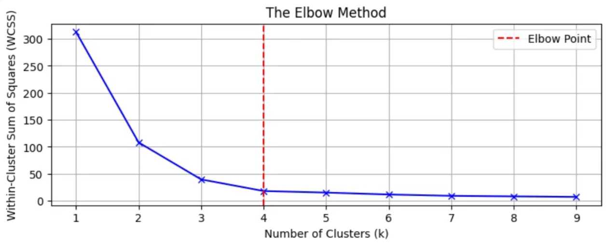

## K-Means

K-Means是数据挖掘中一种**无监督学习**的聚类算法，它尝试将数据集划分成 K 个不同的、不重叠的子集（簇），使得每个簇内部的数据点尽可能相似，而簇与簇之间的数据点尽可能不相似。

### 核心思想

K-Means 的核心思想是**最小化簇内平方和（WCSS）**，即最小化每个数据点到其所属簇中心的距离平方和。

**目标：**

把数据分成 $K$ 个簇，让**同一簇里的点尽量彼此接近、不同簇之间尽量远**。
数学上是让簇内平方误差（SSE）最小：
$$

\text{SSE} = \sum_{k=1}^{K} \sum_{x_i \in C_k} | x_i - \mu_k |^2

$$
* $C_k$：第 $k$ 个簇
* $\mu_k$：第 $k$ 个簇的“中心”（均值）

---

**K-means 具体流程（算法步骤）**

给定：

* 数据点 ${x_1, x_2, \dots, x_n}$
* 想要的簇数 $K$

步骤：

1. **初始化中心（Centroids）**

   * 随机挑 $K$ 个样本点作为初始中心，或者用 K-means++ 等更聪明的方法。
   * 记为 $\mu_1, \mu_2, \dots, \mu_K$。

2. **E 步（分配步骤：Assignment）**

   * 对每个点 $x_i$，算它到各个中心的距离（一般是欧氏距离）
   * 把 $x_i$ 分配给最近的那个中心所属的簇
   * 得到 $K$ 个簇 $C_1,\dots,C_K$

3. **M 步（更新步骤：Update）**

   * 对每个簇 $C_k$，重新计算这个簇的中心：
    $$\mu_k = \frac{1}{|C_k|} \sum_{x_i \in C_k} x_i$$

4. **重复 2 和 3**

   * 直到：

     * 中心位置几乎不再变化，或者
     * 簇的分配不再变化，或者
     * 达到最大迭代次数。

5. 输出每个点的簇标签 + 每个簇中心 $\mu_k$。

注意点：

* 必须事先选好 $K$。
* 对初始中心比较敏感，容易落在“局部最优”。
* 特征量纲差异大时，要**标准化/归一化**（比如 z-score 或 min-max）。

---

### 例子

假设有 4 个点，只考虑 $(x,y)$ 两个特征：

* $A(1,1)$
* $B(1,2)$
* $C(4,4)$
* $D(5,5)$

想要分成 $K=2$ 个簇。

**1. 初始化中心**

随便选两个点当初始中心，例如：

* 簇1 中心 $M_1^{(0)} = A(1,1)$
* 簇2 中心 $M_2^{(0)} = D(5,5)$

**2. 第一次分配**

用欧氏距离的平方（省得写根号）：

* 点 A(1,1)

  * 到 $M_1(1,1)$：$(1-1)^2 + (1-1)^2 = 0$
  * 到 $M_2(5,5)$：$(1-5)^2 + (1-5)^2 = 4^2 + 4^2 = 16+16=32$
    ⇒ A 分到簇1

* 点 B(1,2)

  * 到 $M_1(1,1)$：$(1-1)^2 + (2-1)^2 = 0+1=1$
  * 到 $M_2(5,5)$：$(1-5)^2 + (2-5)^2 = 4^2 + 3^2 = 16+9=25$
    ⇒ B 分到簇1

* 点 C(4,4)

  * 到 $M_1(1,1)$：$(4-1)^2 + (4-1)^2 = 3^2 + 3^2 = 9+9=18$
  * 到 $M_2(5,5)$：$(4-5)^2 + (4-5)^2 = 1^2 + 1^2 = 1+1=2$
    ⇒ C 分到簇2

* 点 D(5,5)

  * 到 $M_1(1,1)$：$(5-1)^2 + (5-1)^2 = 4^2 + 4^2 = 16+16=32$
  * 到 $M_2(5,5)$：0
    ⇒ D 分到簇2

得到的簇：

* 簇1：{A(1,1), B(1,2)}
* 簇2：{C(4,4), D(5,5)}

**3. 第一次更新中心**

* 簇1 新中心：
$
  x: (1+1)/2 = 1,\quad y: (1+2)/2 = 1.5
  \Rightarrow M_1^{(1)} = (1, 1.5)
$

* 簇2 新中心：
$
  x: (4+5)/2 = 4.5,\quad y: (4+5)/2 = 4.5
  \Rightarrow M_2^{(1)} = (4.5, 4.5)
$

**4. 第二次分配（检查是否还会变）**

再算一次（同样用距离平方）：

* A(1,1)

  * 到 $M_1(1,1.5)$：$(1-1)^2 + (1-1.5)^2 = 0 + (-0.5)^2 = 0.25$
  * 到 $M_2(4.5,4.5)$：$(1-4.5)^2 + (1-4.5)^2 = (-3.5)^2 + (-3.5)^2 = 12.25+12.25=24.5$
    ⇒ 仍然簇1

* B(1,2)

  * 到 $M_1(1,1.5)$：$(1-1)^2 + (2-1.5)^2 = 0 + 0.5^2 = 0.25$
  * 到 $M_2(4.5,4.5)$：$(1-4.5)^2 + (2-4.5)^2 = (-3.5)^2 + (-2.5)^2 = 12.25+6.25=18.5$
    ⇒ 仍然簇1

* C(4,4)

  * 到 $M_1(1,1.5)$：$(4-1)^2 + (4-1.5)^2 = 3^2 + 2.5^2 = 9+6.25=15.25$
  * 到 $M_2(4.5,4.5)$：$(4-4.5)^2 + (4-4.5)^2 = (-0.5)^2 + (-0.5)^2 = 0.25+0.25 = 0.5$
    ⇒ 仍然簇2

* D(5,5)

  * 到 $M_1(1,1.5)$：$(5-1)^2 + (5-1.5)^2 = 4^2 + 3.5^2 = 16+12.25=28.25$
  * 到 $M_2(4.5,4.5)$：$(5-4.5)^2 + (5-4.5)^2 = 0.5^2 + 0.5^2 = 0.25+0.25=0.5$
    ⇒ 仍然簇2

簇分配没有变化，中心再算一遍也一样，所以算法**收敛**。

最终结果：

* 簇1：两个比较“左下”的点 A、B
* 簇2：两个比较“右上”的点 C、D

### 评估K-Means的效果

**1. 簇内平方和 (WCSS)**

WCSS 是最基本的度量，值越小表示聚类效果越好（簇内的数据点更紧凑）。

$$
\text{WCSS} = \sum_{j=1}^{K} \sum_{i \in \text{Cluster}_j} \| x_i - \mu_j \|^2
$$

**2. K 值的选择：肘部法则 (Elbow Method)**

* **方法：** 尝试不同的 $K$ 值，计算对应的 WCSS。
* **判断：** 绘制 WCSS 与 $K$ 值的关系图，曲线中 WCSS 显著下降速度变慢的点，形似“肘部”，这个点对应的 $K$ 值通常被认为是最佳的。

<figure style="text-align: center;">
  
  <figcaption>图 1：肘部法则</figcaption>
</figure>

**3. 轮廓系数 (Silhouette Score)**

对某个样本点 (i)，定义两个量：

1. **簇内平均距离 (a(i))**

   * (i) 所在簇记为 (C)
   * (a(i)) = 点 (i) 到同簇里**其他所有点**的平均距离
   * 如果该簇只有一个点，可约定 (a(i)=0)

2. **最近“其他簇”的平均距离 (b(i))**

   * 对每一个**不包含 (i)** 的簇 (C')，计算：
     $$
     d(i, C') = \text{点 } i \text{ 到 } C' \text{ 中所有点的平均距离}
     $$
   * 然后取这些平均距离中的最小值：
     $$
     b(i) = \min_{C' \neq C} d(i, C')
     $$

  有了 (a(i))、(b(i))，轮廓系数定义为：

$$
s(i) = \frac{b(i) - a(i)}{\max\{a(i), b(i)\}}
$$

* **作用：** 结合了簇内聚性和簇间分离性的度量，得分范围在 $[-1, 1]$ 之间。
* **解释：**
    * **接近 1：** 样本与自己的簇高度相似，且与相邻簇差异大。
    * **接近 0：** 样本位于两个簇的边界上。
    * **接近 -1：** 样本可能被错误地分配给了错误的簇。

## DBSCAN
DBSCAN 是“基于密度”的聚类算法，目标是：
* 在**高密度区域**找出簇
* 把**密度低的点**当成噪声（outlier）

### 概念 & 参数

DBSCAN 有两个重要参数：

* **ε（eps）**：邻域半径
* **MinPts**：一个点周围至少多少个点算“密”

基于这两个参数，定义三种点：

1. **核心点（core point）**

   * 点 (p) 的 ε 邻域内（包括自己）点的数量 ≥ MinPts
   * 说明 (p) 在一个“密度高”的区域

2. **边界点（border point）**

   * 本身邻域内点数 < MinPts，但**在某个核心点的邻域内**
   * 说明它挨着“密区”，但自己不够密

3. **噪声点（noise / outlier）**

   * 既不是核心点，也不在任何核心点的邻域内
   * 说明它“孤零零”，被认为是噪声

还有两个概念：

* **密度直达（directly density-reachable）**：
  点 $(q)$ 在核心点 $(p)$ 的 $ε$ 邻域内 → $(q) $对 $(p) $密度直达。
* **密度可达（density-reachable）**：
  从核心点 $(p_1)$ 到 $(p_k)$，存在一串核心点 $(p_1, p_2, \dots, p_k)$，每一个都在前一个的 $ε$ 邻域内，则这些点互相密度可达。

一个聚类就是：**一群互相密度可达的点组成的最大集合**。

### 算法流程

给定：数据集 D，参数 `eps` 和 `MinPts`

1. 把所有点标记为 **未访问**。

2. 遍历每个点 (p)：

   1. 如果 (p) 已访问，跳过；否则标记为已访问。
   2. 找出 (p) 的 ε 邻域中的所有点（记为 `neighbors`）。
   3. 如果 `neighbors` 数量 < MinPts：

      * 把 (p) 标记为**噪声（先暂时记为噪声）**，之后有可能被归到某簇里。
   4. 否则：

      * 把 (p) 作为核心点，新建一个**聚类 C**，把 `neighbors` 里的点都放进 C。
      * 对 C 中每一个点 (q) 再做：

        * 如果 (q) 还没访问过：标记已访问，并找出它的 ε 邻域 `neighbors_q`。
        * 如果 `neighbors_q` 数量 ≥ MinPts：

          * 把 `neighbors_q` 全部并入 C（簇会“长大”）。
        * 如果 (q) 之前被标记为噪声，就把噪声标签去掉，归到 C 里。

3. 所有点遍历完，得到所有簇。

### 例子

为了好算，先用一维数据（可以想象成一条数轴上的点）：

数据点：
$$
{1.0,\ 1.2,\ 1.3,\ 10.0,\ 10.2,\ 10.4,\ 50.0}
$$

设参数：

* `eps = 0.5`
* `MinPts = 3`（邻域内至少 3 个点才算“密”）

**1. 看每个点邻域有多少点**

**以点 1.2 为例：**

* 它的 ε 邻域范围是 ([1.2-0.5, 1.2+0.5] = [0.7, 1.7])
* 落在这个区间的点有：1.0, 1.2, 1.3 → 一共 3 个
* ≥ MinPts=3，所以 1.2 是**核心点**

类似地：

* 点 1.0 的邻域 ([0.5, 1.5])：包含 {1.0, 1.2, 1.3} → 3 个 → **核心点**
* 点 1.3 的邻域 ([0.8, 1.8])：包含 {1.0, 1.2, 1.3} → 3 个 → **核心点**

所以 **1.0, 1.2, 1.3** 全是核心点，它们互相密度可达，形成一个簇（簇1）。

---

再看中间那一群：

* 点 10.0 的邻域 ([9.5, 10.5])：包含 {10.0, 10.2, 10.4} → 3 个 → 核心点
* 点 10.2 的邻域 ([9.7, 10.7])：同样包含 {10.0, 10.2, 10.4} → 核心点
* 点 10.4 的邻域 ([9.9, 10.9])：同理 → 核心点

所以 **10.0, 10.2, 10.4** 也是一簇（簇2）。

---

最后看 50.0：

* 邻域 ([49.5, 50.5]) 内只有它自己 → 1 个点 < MinPts=3
* 它不在任何核心点邻域里，所以既不是核心点，也不是边界点
  → 被标记为 **噪声点**

**2. 最终结果**

* **簇 1**：{1.0, 1.2, 1.3}
* **簇 2**：{10.0, 10.2, 10.4}
* **噪声**：{50.0}

## License

Copyright 2025-present [Ginyee-W](https://ginyee-w.github.io/).
